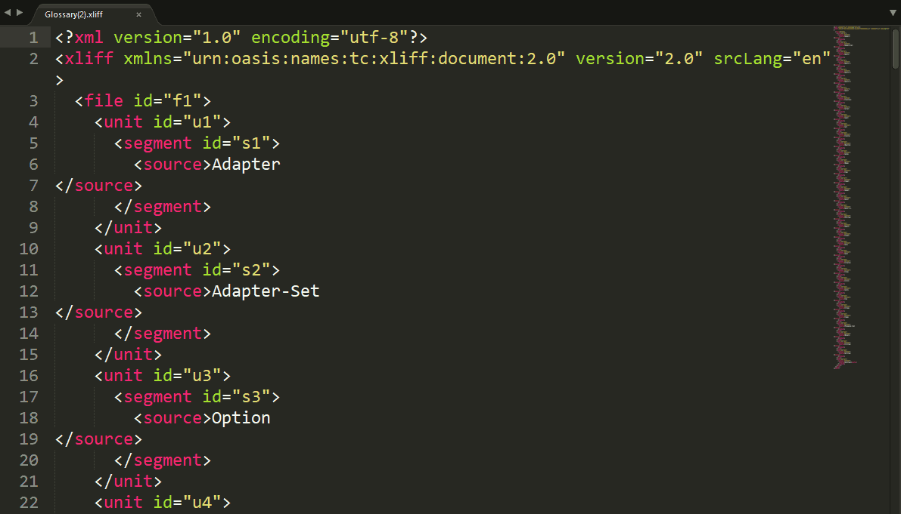

<p align="center"><a href="https://laravel.com" target="_blank"></a></p>


# Repser API Client
The Repser Client lets use Repser API ([Repser API]( https://github.com/wie1900/api_repser)) to reduce array of items to array containing unique elements only. 

__Real-life example:__

items of spare parts catalog, which usually contains a lot of almost identical text parts like names, short descriptions, section names etc. can be __reduced by several dozen percent__. After reducing the 'glossary'-array contains only first appearances of all repeated items.

We named the reduced array _‘Glossary’_ because once translated it can be used as Translation memory for:
1. the 100% of the remaining repeated items in the source array
2. other similar projects

## Usage
Access to the client application and thus to the Repser API is protected by Laravel UI auth. So, first, log-in with email and password to get into the Repser Client site.

Then:
1. Insert  source array into _Source text_ field (each item must be in separate line)
2. Click _Send It to process_ button
3. Wait until the status information (above _Logout_ button) shows: _'Final - parts sent...'_.
On the right there is number of parts sent to the API and number of segments (source array items) in total.

The reduced array will be visible in the _Glossary_ input field.


If necessarily, choose _'Save Glossar As..'_ to save the final reduced array as TTX- or XLIFF-file.



## Architecture

The application is composed of three layers:
1. Login security-shell (Laravel UI auth)
2. Client front-end (Bootstrap + Javascript + Ajax requests)
3. Back-end layer (PHP) for communication with API

__Login__

Access to application site is possible only for authorized users (existing in local SQLite database). Hence, first you must log-in with email and password.  

__Front-end__

Due to performance issues (it is recommended to send to API up to 500-elements arrays) all requests are performed by Ajax – longer arrays are split, sent in parts to the API and processed automatically.
 
For security reasons Ajax requests are calls to intern Laravel functionality on the same server (used here as middleware between Client’s front-end and remote API on the other server). This way sensitive data like Bearer token required by Repser API or API endpoints URLs are secured.


The main data manager is **[Postman](resources/js/reps/postman.js)**-class:
```
+---resources
|   +---js
|   |   +---reps
|   |   |   |   glossary.js
|   |   |   |   postman.js
|   |   |   |   source.js
|   |   |   |   statusworker.js
```

__Postman__ is responsible for processing of source and glossary arrays, creating Ajax requests, sending and receiving arrays to and from the API (indirectly) and updating interface elements with processed data:
- Source text input field
- Glossary input field
- two status divs for status alerts  

__Back-end__

Requests to the Repser API are performed in **[ClientController](app/Http/Controllers/ClientController.php)** accordingly to routes called by Ajax-requests:
- /getglossary (for array processing)
- /getfile (for saving reduced array as TTX/XLIFF-file)

Sensitive data like API endpoints addresses and the required token are provided by **[ApiGuard](app/Custom/ApiGuard.php)** class.

## What was used
- Laravel 9 + UI auth
- Bootstrap 5
- Javascript + jQuery (Ajax requests)
- PHP 8

## Working version

The working version is available (required email / password: user@user.com / user) at:
[https://reps.deadygo.com](https://reps.deadygo.com)
